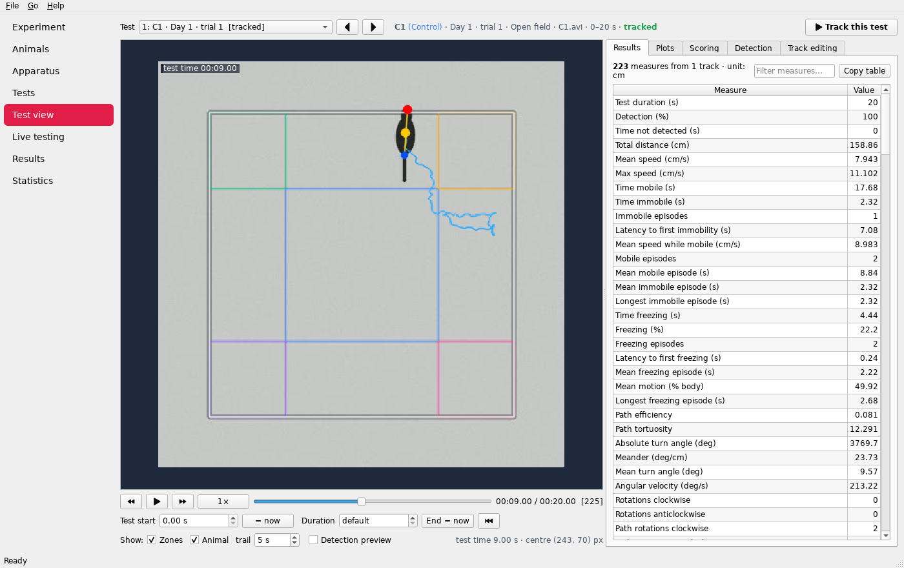

# mANY-MAZE

**A libre, fully featured video-tracking and behavioural-analysis suite for animal behaviour experiments —
an open alternative to ANY-maze that runs natively on Apple Silicon Macs.**

mANY-MAZE follows the familiar workflow — *experiment → animals → apparatus → tests → tracking & scoring →
results → statistics* — and covers the standard behavioural tests out of the box: open field, elevated plus and
zero mazes, Y / T / radial arm mazes, Morris water maze, Barnes maze, novel object recognition, light/dark box,
three-chamber sociability, fear conditioning (freezing), forced swim / tail suspension and fully custom
apparatus.

License: **GPL-3.0-or-later** (the optional, separately downloaded pose-model weights are licensed by their authors
for academic, non-commercial use). Written in Python with OpenCV, NumPy/SciPy, matplotlib and Qt 6 (PySide6) — all
of which ship native `arm64` builds for macOS, so the app runs natively on M1/M2/M3/M4 Macs (no Rosetta).



More screenshots: [experiment](docs/screenshots/experiment.png) · [apparatus designer](docs/screenshots/apparatus.png) ·
[tests](docs/screenshots/tests.png) · [live testing](docs/screenshots/live.png) · [results](docs/screenshots/results.png) ·
[statistics](docs/screenshots/statistics.png)

## Features

| Area | What you get |
| --- | --- |
| **Experiments** | Protocol templates, stages (days/sessions), test duration, automatic start when the animal is detected, per-experiment detection & analysis defaults, portable experiment folders |
| **Animals** | Groups/treatments with colours, sex, unlimited custom fields, CSV import/export |
| **Apparatus designer** | Draw arenas, rectangle/ellipse/polygon zones, points of interest, crossing lines, zone groups (union − exclusion), calibration in cm; one-click templates fitted to your video; several apparatus per video |
| **Video tracking** | Background subtraction (median / empty-arena frame / adaptive) or thresholding; dark, light or auto contrast; body centre, **head and tail** detection; multiple animals per arena with identity maintenance; multiple arenas per video in a single pass; gap interpolation & smoothing; pixel-change motion index for freezing |
| **AI body parts** | Optional deep-learning pose model (DeepLabCut SuperAnimal-TopViewMouse, 27 keypoints) for nose / centre / tail base, robust to shadows and reflections; runs on the **Neural Engine / GPU via Core ML**; bring-your-own ONNX models |
| **Apple Silicon speed** | Parallel tracking of many videos across all cores, **VideoToolbox** hardware decoding (greyscale straight from the luma plane) and hardware H.264 recording |
| **Live testing** | Cameras via AVFoundation, simultaneous recording, start on detection, procedures (zone/time/freezing triggers → serial/TTL commands, beeps, event marks, end test) for Arduino-driven stimuli |
| **Manual scoring** | Keyboard-scored state and point behaviours during playback or live |
| **Track tools** | Review with overlays, detection preview while tuning, track corrections, DeepLabCut CSV import |
| **Measures** | 100+ measures: distance, speeds, mobility, freezing, rotations, path efficiency, thigmotaxis, grid crossings; per-zone time/entries/latency/distance/head entries; per-point exploration; line crossings; EPM open-arm %, Y-maze spontaneous alternation, radial-arm errors, water-maze latency/platform crossings/Gallagher proximity/heading error/search strategy, Barnes primary latency/errors/strategy, NOR discrimination index, sociability index, light/dark transitions, social contact |
| **Time segmentation** | Regular time bins or custom named periods (e.g. CS/tone periods) |
| **Results & reports** | Results table with measure chooser, CSV/Excel export, clipboard copy, self-contained HTML reports with track plots, heat maps and statistics |
| **Statistics** | Descriptives, Welch t / Mann-Whitney, ANOVA + Tukey / Kruskal-Wallis, paired tests & Friedman, two-way ANOVA (group × stage), correlations, effect sizes, publication-style plots |
| **Automation** | `manymaze` command line for batch tracking, export and reports |

See the full [user guide](manymaze/resources/USER_GUIDE.md) (also available in the app under *Help*).

## Install on an Apple Silicon Mac

### Option A — build the app (`mANY-MAZE.app` + `.dmg`)

```bash
# Python 3.10+ for arm64, e.g. from python.org or Homebrew:  brew install python@3.12
git clone <this repository> many-maze && cd many-maze
scripts/build_macos.sh
open dist/mANY-MAZE.app        # or install from dist/mANY-MAZE-<version>-arm64.dmg
```

The script builds a native `arm64` bundle with PyInstaller, ad-hoc signs it and wraps it in a DMG. The first time
you open it, macOS may ask you to confirm (right-click ▸ *Open*) because it is not notarised, and it will ask for
camera permission when you start a live test. GitHub Actions builds the same DMG on Apple Silicon runners
(`.github/workflows/ci.yml`).

### Option B — run from source

```bash
python3 -m venv .venv
.venv/bin/pip install -e ".[serial]"     # pyserial is optional (I/O procedures)
.venv/bin/manymaze                        # launch the GUI
```

Also works on Linux and Windows.

## Quick start

1. *File ▸ Create demo experiment* — six synthetic open-field videos, two groups, already tracked.
2. Browse **Test view** to see tracks, tune detection, and score behaviours with the keyboard.
3. **Results** → choose measures → export to Excel or generate an HTML report.
4. **Statistics** → compare *Centre: time (%)* between *Control* and *Anxious*.

For your own experiment: *File ▸ New experiment* → add animals → in **Apparatus** load a frame from one of
your videos and *Create from template* → **Tests ▸ Add tests from videos** → *Track all* → **Results**.

### Command line

```bash
manymaze demo ~/Desktop/demo.mmaze
manymaze track video.mp4 --template open_field --bbox 18,48,594,412 --size-cm 40 -o results.csv
manymaze project ~/Experiments/EPM.mmaze track
manymaze project ~/Experiments/EPM.mmaze results -o results.xlsx --bins
manymaze project ~/Experiments/EPM.mmaze report -o report.html
```

## Accuracy

* Synthetic videos (tests): body centre error < 4 px, head detected within 12 px in > 85 % of frames.
* Real footage (DeepLabCut open-field example frames, black mouse on white floor, single-frame detection
  without temporal cues): median nose error 3.5 px, tail-base error 4.5 px, no head/tail inversions; ~250 fps
  tracking at 640×480 on two x86 cores.
* With the pose model: median nose error 3.0 px, tail-base error 2.6 px on the same labelled frames, and correct
  head/centre where the shape method is fooled by reflections on the walls.
* `scripts/benchmark.py` measures decoding, recording, pose inference and parallel tracking on your machine; CI
  runs it on Apple Silicon (see the *benchmark* job summary).

## Development

```bash
.venv/bin/pip install -e ".[dev]"
QT_QPA_PLATFORM=offscreen .venv/bin/python -m pytest -q
```

Code layout: `manymaze/core` is the GUI-independent engine (geometry, apparatus & templates, tracking,
measures, project files, statistics, plots, export, live sessions & procedures); `manymaze/gui` is the PySide6
application; `manymaze/cli.py` the command line.

mANY-MAZE is an independent project and is not affiliated with Stoelting Co. or the makers of ANY-maze.
