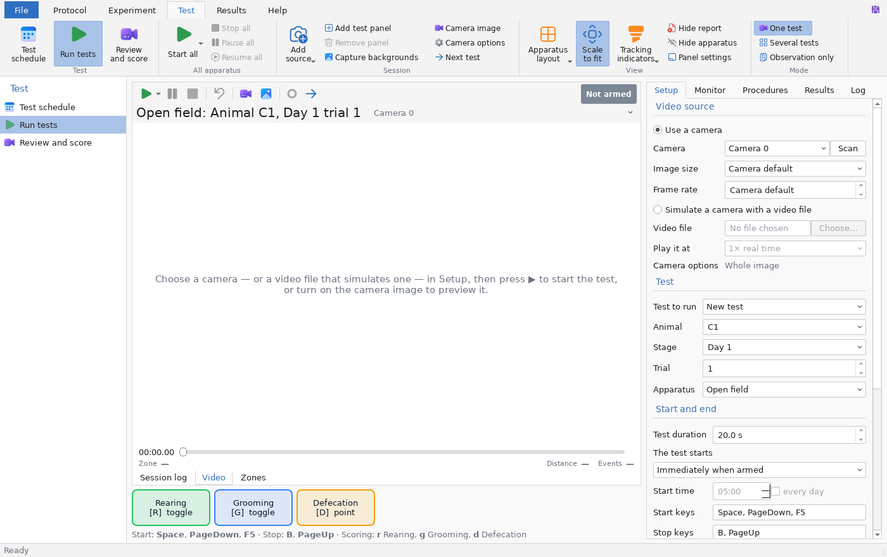

# mANY-MAZE

**A libre, fully featured video-tracking and behavioural-analysis suite for animal behaviour experiments —
an open alternative to ANY-maze that runs natively on Apple Silicon Macs.**

mANY-MAZE follows the familiar workflow — *experiment → animals → apparatus → tests → tracking & scoring →
results → statistics* — and covers the standard behavioural tests out of the box: open field, elevated plus and
zero mazes, Y / T / radial arm mazes, Morris water maze, Barnes maze, novel object recognition, light/dark box,
three-chamber sociability, fear conditioning (freezing), forced swim / tail suspension, conditioned place
preference, hole board, operant and touch-screen tasks, zebrafish novel tank and multi-well plates, and fully
custom apparatus.

License: **GPL-3.0-or-later** (the optional, separately downloaded pose-model weights are licensed by their authors
for academic, non-commercial use). Written in Python with OpenCV, NumPy/SciPy, matplotlib and Qt 6 (PySide6) — all
of which ship native `arm64` builds for macOS, so the app runs natively on M1/M2/M3/M4 Macs (no Rosetta).



The window follows ANY-maze — ribbon tabs **File · Protocol · Experiment · Test · Results**, an explorer on the
left of each tab, ANY-maze terminology (treatments, keys, stages, test schedule, apparatus map) — so ANY-maze users
can switch without retraining. Screenshots: [protocol](docs/screenshots/protocol.png) ·
[keys](docs/screenshots/keys.png) · [procedures](docs/screenshots/procedures.png) ·
[apparatus map](docs/screenshots/apparatus.png) · [experiment](docs/screenshots/experiment.png) ·
[test schedule](docs/screenshots/test_schedule.png) · [review and score](docs/screenshots/review.png) ·
[data](docs/screenshots/data.png) · [track plots](docs/screenshots/track_plots.png) ·
[heat maps](docs/screenshots/heat_maps.png) · [charts](docs/screenshots/charts.png) ·
[statistics](docs/screenshots/statistics.png) · [file](docs/screenshots/file.png)

## Features

| Area | What you get |
| --- | --- |
| **Experiments** | Protocol templates, up to 50 stages × 99 trials, schedules (by animal / trial / randomised / Latin square, counterbalancing), test duration, automatic start, training criteria with automatic retirement, blind testing, animal ID / barcode confirmation, skip / re-perform, per-experiment detection & analysis defaults, portable experiment folders, new experiments based on another one's protocol, printable protocol report, automatic backups, zip archives with all videos |
| **Animals** | Groups/treatments with colours, sex, unlimited custom fields, retirement, dose calculator, balanced random allocation to treatments (stratified by sex or any column), CSV import/export |
| **Apparatus designer** | Arenas, rectangle/ellipse/polygon zones, points, lines, zone groups (union − exclusion), square / concentric / radial grids in real-world units, sequences, hidden / investigation / moveable zones, entry by centre, head, tail or % of body, copy/paste, calibration; 20+ templates fitted to your video (incl. novel tank, multi-well plates, place preference, hole board, thermal gradient, home cage); several apparatus per video |
| **Video tracking** | Background subtraction (median / empty-arena frame / adaptive) or thresholding; dark, light or auto contrast; body centre, **head and tail**; tracking by colour; multiple animals per arena with identity maintenance (or identification by colour marks); multiple arenas per video in one pass; erasing of thin wires / cage bars; gap interpolation & smoothing; motion index for freezing; videos split over several files (M3U playlists) |
| **AI body parts** | Optional deep-learning pose model (DeepLabCut SuperAnimal-TopViewMouse, 27 keypoints) for nose / centre / tail base, robust to shadows and reflections; runs on the **Neural Engine / GPU via Core ML**; bring-your-own ONNX models |
| **Live testing** | Up to **48 cameras and 40 simultaneous tests** (ANY-maze's scale) from several cameras and/or several apparatus per camera, grid layouts up to 8 × 6 panels, collective start / pause / stop, start on detection / when the experimenter leaves the view / on a key or remote / at a clock time, real-time zone statistics, live charts, I/O status and warnings, camera region / zoom / rotate / two-camera merge, recording with optional burned-in labels (split into consecutive files for 24 h tests), calibration adjustable while a test runs (stored with that test), observation-only (TakeNote) mode |
| **Procedures & hardware** | Visual procedure editor (when / wait / if / repeat / set / do), 62 events, 72 actions, safe expressions with maths and random functions, variables and arrays kept between tests or saved as results, reinforcement schedules (FR, VR, FI, VI, PR…); open **Arduino firmware** for TTL inputs/outputs, levers, nose pokes, movement detectors, pellet dispensers (with jam detection), shockers (calibrated intensity), optogenetic pulse trains and pulse sequences from files, running-wheel encoders, analogue inputs at up to 1 kHz with filters, load cells and temperature / humidity sensors, sync pulses; **Firmata boards, National Instruments (NI-DAQmx), LabJack, USB-serial cable lines**; **syringe pumps** (New Era, Harvard, KD Scientific, Chemyx… with 131 predefined syringes, stall detection, volumes infused / withdrawn) and **balances** (animal weights); temperature controllers with ramps, light ramps, olfactometers, liquid dippers / drippers; sensor alerts by e-mail / SMS; serial devices; audio tones / noise / looped sound files; touch-screen stimuli |
| **Manual scoring** | Keys (toggle, hold or point, up to 46), exclusive sets, on-screen / touch buttons, scoring during playback, live or by direct observation |
| **Track tools** | Review with overlays, detection preview while tuning, track corrections, per-test moveable-zone positions, per-test apparatus position (camera moved), identity swaps for several animals, DeepLabCut CSV import |
| **Measures** | Hundreds of measures: ~40 whole-apparatus, ~20 per zone, ~17 per point, per line, ~13 per sequence, per grid, social (contacts, nose-to-nose, following, approaches), per key (also per zone), I/O inputs/outputs/encoders, result variables; test-specific results for EPM/EZM, Y/T/radial mazes, water maze (incl. Whishaw corridor, strategies), Barnes, NOR, light/dark, three-chamber, CPP, novel tank, hole board… |
| **Time segmentation** | Regular time bins, custom periods and **event-anchored periods** (e.g. the 30 s after first leaving a zone); pauses excluded |
| **Visualisation** | Track plots coloured by speed / time / any parameter with behaviour markers and per-period panels; **animated track playback** at 0.25–16× speed; heat maps (normalised, per behaviour, group-averaged with alignment); charts of 40+ parameters over time with zone bands and mouse-wheel zoom; **tracked-video export with overlays** |
| **Statistics** | 43 procedures: t / Welch / Mann-Whitney, one-way / Welch ANOVA, Kruskal-Wallis, repeated-measures and mixed ANOVA, two-way (incl. Scheirer–Ray–Hare and ART), post-hoc (Tukey, Bonferroni, Holm, Šidák, FDR, Dunnett, Games–Howell, Dunn), Friedman, chi-square / G / Fisher, correlations & regression, ANCOVA, assumption checks, effect sizes; grouping at up to 3 levels; column / line / scatter / box / violin graphs |
| **Data transfer** | **Import from ANY-maze**: its experiment XML export (animals, treatments, tests, tracks, zone positions, calibration), zone maps (apparatus zones) and spreadsheets (animals, treatments, test schedules and track data, from ANY-maze or other software, with automatic column matching); CSV, tab-separated, Excel, SYLK, dBase III/IV, clipboard (any cell range), **XML of the whole experiment incl. raw tracks**, raw per-frame CSV with derived parameters, one row per animal (stages / trials as columns), test event logs, self-contained HTML reports |
| **Apple Silicon speed** | Parallel tracking across all cores, **VideoToolbox** hardware decoding / recording, Core ML inference |
| **Automation** | `manymaze` command line for batch tracking, export and reports |

See the full [user guide](manymaze/resources/USER_GUIDE.md) (also available in the app under *Help*). *Help ▸ Check
for updates* looks for a newer release on GitHub (optionally at startup, at most once a week; set
`MANYMAZE_UPDATE_REPO=owner/name` to follow another repository).

## Install on an Apple Silicon Mac

### Option A — build the app (`mANY-MAZE.app` + `.dmg`)

```bash
# Python 3.10+ for arm64, e.g. from python.org or Homebrew:  brew install python@3.12
git clone <this repository> many-maze && cd many-maze
scripts/build_macos.sh
open dist/mANY-MAZE.app        # or install from dist/mANY-MAZE-<version>-arm64.dmg
```

The script builds a native `arm64` bundle with PyInstaller, ad-hoc signs it and wraps it in a DMG. The first time
you open it, macOS blocks it because it is not notarised: allow it in *System Settings ▸ Privacy & Security ▸ Open Anyway*
(or run `xattr -dr com.apple.quarantine dist/mANY-MAZE.app`), and it will ask for
camera permission when you start a live test. GitHub Actions builds the same DMG on Apple Silicon runners
(`.github/workflows/ci.yml`).

#### Signed and notarised macOS builds

With an Apple Developer ID the script signs every binary with the hardened runtime and
`packaging/entitlements.plist` (camera; unsigned executable memory and disabled library validation, which the
bundled Python and its extension modules need), notarises the app and the DMG with `xcrun notarytool submit --wait`
and staples the tickets, so Gatekeeper opens the app without a warning. It reads these environment variables (in CI,
repository secrets of the same names, passed to the *macos-app* job); without them it falls back to the ad-hoc
signature:

| Variable | Value |
| --- | --- |
| `MACOS_CERTIFICATE` | base64 of the *Developer ID Application* certificate exported with its private key as `.p12` (`base64 -i cert.p12`) — imported into a temporary keychain that is deleted afterwards |
| `MACOS_CERTIFICATE_PASSWORD` | the `.p12` password |
| `MACOS_SIGN_IDENTITY` | optional: the identity name (default: the certificate's *Developer ID Application: …*); locally, setting only this signs with an identity already in your keychain |
| `APPLE_API_KEY`, `APPLE_API_KEY_ID`, `APPLE_API_ISSUER` | notarisation with an App Store Connect API key: base64 of the `.p8` file, its key ID and the issuer ID |
| `APPLE_ID`, `APPLE_TEAM_ID`, `APPLE_APP_PASSWORD` | or notarisation with an Apple ID, its team ID and an app-specific password |

Signed but without notarisation credentials, the build is signed only (Gatekeeper still asks on first launch).

### Option B — run from source

```bash
python3 -m venv .venv
.venv/bin/pip install -e ".[serial]"     # pyserial is optional (I/O procedures)
.venv/bin/manymaze                        # launch the GUI
```

Cameras: webcams, UVC cameras and analogue capture cards work through OpenCV. Industrial GigE Vision / USB3 Vision
cameras need their vendor's SDK: `pip install -e ".[basler]"` (pypylon) or `".[genicam]"` (harvesters + the
vendor's GenTL `.cti` producer); FLIR / Teledyne (PySpin) and IDS (ids_peak) wheels come with their SDKs. Exposure,
gain, white balance, focus, pixel format and external trigger are set per camera (user guide, *Camera options*).

Also works on Linux and Windows.

## Quick start

1. **File ▸ Open demo experiment** — six synthetic open-field videos, two treatments, already tracked.
2. **Test ▸ Review and score** — see tracks, tune detection, and score keys with the keyboard or on-screen buttons.
3. **Results ▸ Data** — choose measures (*Select data*), export to Excel or create an HTML report.
4. **Results ▸ Statistics** — compare *Centre: time (%)* between *Control* and *Anxious*.

For your own experiment: **File ▸ New experiment** → **Protocol ▸ Apparatus**: load a frame from one of your videos
and *From template* → **Experiment**: add animals and treatments (or *Import animals* from an ANY-maze spreadsheet) →
**Test ▸ Test schedule ▸ Add tests from videos** → *Track all untracked* → **Results**.

### Command line

```bash
manymaze demo ~/Desktop/demo.mmaze
manymaze track video.mp4 --template open_field --bbox 18,48,594,412 --size-cm 40 -o results.csv
manymaze project ~/Experiments/EPM.mmaze track
manymaze project ~/Experiments/EPM.mmaze results -o results.xlsx --bins   # or .csv .tsv .slk .dbf .xml
manymaze project ~/Experiments/EPM.mmaze report -o report.html
```

## Accuracy

* Synthetic videos (tests): body centre error < 4 px, head detected within 12 px in > 85 % of frames.
* Real footage (DeepLabCut open-field example frames, black mouse on white floor, single-frame detection
  without temporal cues): median nose error 3.5 px, tail-base error 4.5 px, no head/tail inversions; ~250 fps
  tracking at 640×480 on two x86 cores.
* With the pose model: median nose error 3.0 px, tail-base error 2.6 px on the same labelled frames, and correct
  head/centre where the shape method is fooled by reflections on the walls.
* `scripts/benchmark.py` measures decoding, recording, pose inference and parallel tracking on your machine; CI
  runs it on Apple Silicon (see the *benchmark* job summary).

## Development

```bash
.venv/bin/pip install -e ".[dev]"
QT_QPA_PLATFORM=offscreen .venv/bin/python -m pytest -q
```

Code layout: `manymaze/core` is the GUI-independent engine (geometry, apparatus & templates, tracking,
measures, project files, statistics, plots, export, live sessions & procedures); `manymaze/gui` is the PySide6
application; `manymaze/cli.py` the command line.

mANY-MAZE is an independent project and is not affiliated with Stoelting Co. or the makers of ANY-maze.
